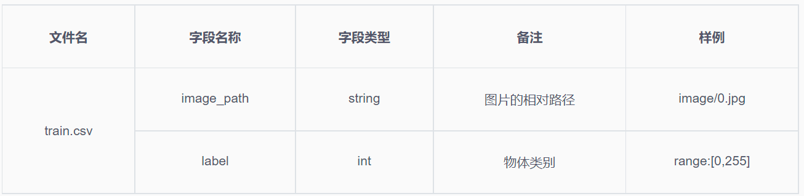

# Caltech256
Caltech256 图像分类竞赛的代码实现。
## 大赛简介
Caltech-256 物品分类数据集由Caltech-101数据集演变而来，该数据集选自Google Image数据集，并手工去除了不符合其类别的图片。在该数据集中共有30,607张图片，256个图片类别，每个类别包括超过80张图片。
## 参赛须知
报名时间
2019-09-20 12:00:00 - 2023-06-10 12:00:00  
参赛时间：2019.09.20 12:00:00-2022.10.10 12:00:00
### 赛事主题和数据说明
#### 赛题描述
通过迭代自己的算法模型并提交训练，获取奖金池高额奖金。小提示：抢先更新算法排行榜，有更大机会获取高额奖金哦
#### 数据描述
由于需要提交代码作品在云端进行训练，参赛数据集不对外开放。仅提供调试数据。  
字段说明：

### 评审标准
#### 算法输入输出格式
输入字段： image_path,  
输出字段： label,
#### 评审指标说明
- 准确率（Accuracy）：对于给定的测试数据集，预测正确的样本数与实际总样本数之比
- True，表示预测正确的样本数数量
- Total Number of Samples，表示实际总样本数数量
- 计算公式如下：
$$
\text { Score }=100 * \frac{\text { True }}{\text { Total Number of Samples }}
$$